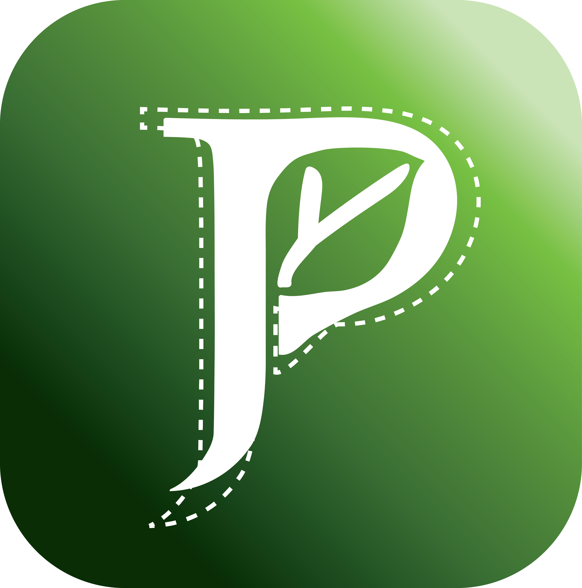

# PlanTry
## _A collaborative pantry organizational apps that allow household members to “Plan” their pantry and “Try” new recipes._

## Co-founders
|Name|Email|
|----|-----|
|E Jinq Heng|heng.4@wright.edu|
|Akshata Kanaparthi|kanaparthi.6@wright.edu|
|Kusuma Kumbham|kumbham.6@wright.edu|
|Sathwika Parshaboina|parshaboina.2@wright.edu|
|Sivakrishna Meda|meda.9@wright.edu|

## Project Description
## Platform:
 Android (in development), iOS (future development)

## Features:
* Reminder list
    * Mark an item as staples
    * Input expiry date of an item
    * Mark an item as "used" or "trash"
* Geolocation reminder
    * Pop up notifaction prompting user to purchase certain staples when they are within _x_ radius of grocery store
* Savings helper
    * Browse local coupon and prompt user best time to purchase an item
* Recipes Recommendation
 
## Prototype:
https://www.figma.com/file/MBX8fVfUYa6WxFLeaMA7sm/PlanTry?node-id=0%3A1